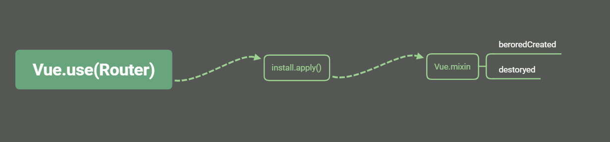

# Vue-Router


## 使用

```javascript
import Vue from 'vue';
import Router from 'vue-router';

Vue.use(Router);
const router = new Router({ config });

new Vue({
    router,
    render: h => h();
}).$mount('#app');

// vue.beforecreate

// <router-view></router-view>

this.$router.push('path');

```


## Vue.use



###  install(Vue) 

```javascript
// 挂载生命周期
 Vue.mixin({
    // Vue beforeCreate 时执行
    beforeCreate () {
    },
    destroyed () {
     // do something
    }
  })

// 注册组件 


// keep-alive 待补充
```

### Vue.component

```javascript
// Vue.component('RouterView', View)
// Vue.component('RouterLink', Link)
Vue.component = function(id: string, definition: Function | Object){
    if (type === 'component' && isPlainObject(definition)) {
        definition.name = definition.name || id
        // 挂载组件
        definition = this.options._base.extend(definition)
    }
    return definition;
}
```


## new Router({ config })


```javascript
constructor (options: RouterOptions = {}) {
  // 创建路由映射
  this.matcher = createMatcher(options.routes || [], this)  
  
  // 创建 history 实例
  switch (mode) {
      case 'history':
        this.history = new HTML5History(this, options.base)
        break
      case 'hash':
        this.history = new HashHistory(this, options.base, this.fallback)
        break
      case 'abstract':
        this.history = new AbstractHistory(this, options.base)
        break
      default:
        if (process.env.NODE_ENV !== 'production') {
        }
    }  
}

// 创建路由映射
export function createMatcher (
  const { pathList, pathMap, nameMap } = createRouteMap(routes)

  function getRoutes () {
    return pathList.map(path => pathMap[path])
  }
}


```


## Vue beforeCreate


```javascript
// 初始化  
  this._router.init(this)
          
// _route 双向绑定，  _route 改变，自动调用 Vue render 方法
  Vue.util.defineReactive(this, '_route', this._router.history.current)  

// VueRouter init
function init(app) {
    const setupListeners = routeOrError => {
        history.setupListeners()
        handleInitialScroll(routeOrError)
      }
    
      history.transitionTo(
        history.getCurrentLocation(),
        setupListeners,
        setupListeners
      )
    }

	// 路由改变，触发响应，更新视图
    history.listen(route => {
      this.apps.forEach(app => {
        app._route = route
      })
    })
}

// history
 const handleRoutingEvent = () => {
     const current = this.current

      // Avoiding first `popstate` event dispatched in some browsers but first
      // history route not updated since async guard at the same time.
      const location = getLocation(this.base)
      if (this.current === START && location === this._startLocation) {
        return
      }

      this.transitionTo(location, route => {
        if (supportsScroll) {
          handleScroll(router, route, current, true)
        }
      })
    }
    window.addEventListener('popstate', handleRoutingEvent)
    this.listeners.push(() => {
      window.removeEventListener('popstate', handleRoutingEvent)
})

// hash
    const handleRoutingEvent = () => {
      const current = this.current
      if (!ensureSlash()) {
        return
      }
      this.transitionTo(getHash(), route => {
        if (supportsScroll) {
          handleScroll(this.router, route, current, true)
        }
        if (!supportsPushState) {
          replaceHash(route.fullPath)
        }
      })
    }
    const eventType = supportsPushState ? 'popstate' : 'hashchange'
      window.addEventListener(
        eventType,
        handleRoutingEvent
      )
    this.listeners.push(() => {
      window.removeEventListener(eventType, handleRoutingEvent)
    })
```


## RouterView


```javascript
// View 源码，已简化
export default {
  name: 'RouterView',
  functional: true,
  props: {
    name: {
      type: String,
      default: 'default'
    }
  },
  render (_, { props, children, parent, data }) {
    const route = parent.$route
    // matched 在 new Router({ config }) 已映射  
    const matched = route.matched[depth]
    const component = matched && matched.components[name]  
    
    // keep-alive 缓存
    const cache = parent._routerViewCache || (parent._routerViewCache = {})
    if (vnodeData.keepAlive && parent._directInactive && parent._inactive) {
      inactive = true
     }
    if (inactive) {
      const cachedData = cache[name]
      const cachedComponent = cachedData && cachedData.component
      if (cachedComponent) {
        // pass props
        if (cachedData.configProps) {
          fillPropsinData(cachedComponent, data, cachedData.route, cachedData.configProps)
        }
        return h(cachedComponent, data, children)
      } else {
        // render previous empty view
        return h()
      }  
    }
    return h(component, data, children)  
  }
} 

```


## $router.push('path')


```javascript
// hash
    this.transitionTo(
      location,
      route => {
        pushHash(route.fullPath)
        handleScroll(this.router, route, fromRoute, false)
        onComplete && onComplete(route)
      },
      onAbort
    )

function pushHash (path) {
  // 监听 hashchange 使用 window.location.hash
  if (supportsPushState) {
    pushState(getUrl(path))
  } else {
    window.location.hash = path
  }
}

// history
    this.transitionTo(location, route => {
      pushState(cleanPath(this.base + route.fullPath))
      handleScroll(this.router, route, fromRoute, false)
      onComplete && onComplete(route)
    }, onAbort)

function pushState (url?: string, replace?: boolean) {
    const history = window.history
    if (replace) {
       history.replaceState(stateCopy, '', url) 
    } else {
       history.pushState({ key: setStateKey(genStateKey()) }, '', url) 
    }
}
```


## 简易路由实现

### 核心

**监听**浏览器url变化，改变页面元素，添加 window.addEventListener('popstate', handleEvent)

**改变**浏览器 url  history.pushState({ key: setStateKey(genStateKey()) }, '', url)、history.replaceState(stateCopy, '', url)，触发 popstate 事件，会触发 

popstate 事件，只有 history 实体变化才触发，
popstate事件一般与pushState()和replaceState()这两个方法搭配使用
hashchange 事件，当URL的片段变更时使用，hash 模式下，hashchange 避免死循环使用

```javascript
// pushHash
window.location.hash = path
// replaceHash
window.location.replace(url)
```

### 实现

```html
// html
<!DOCTYPE html>
<html>

<head>
  <title>router</title>
  <style>
    #nav {
      display: flex;
      list-style: none;
    }

    #nav li {
      margin: 1px;
      padding: 8px 16px;
      background-color: #ebebeb;
      color: #000;
      font-size: 16px;
      cursor: pointer;
    }

    .content {
      width: 200px;
      height: 200px;
      font-size: 24px;
      text-align: center;
      line-height: 200px;
    }

    .hidden {
      display: none;
    }
  </style>
</head>

<body>
   <ul id="nav">
    <li data-path="a">a</li>
    <li data-path="b">b</li>
    <li data-path="c">c</li>
    <li data-path="d">d</li>
  </ul>
  <div id="a" class="content">A</div>
  <div id="b" class="hidden content">B</div>
  <div id="c" class="hidden content">C</div>
  <div id="d" class="hidden content">D</div>

  <script src="./router.js"></script>
</body>

</html>
```

```javascript
// js
window.onload = function() {
  const pathList = ['a', 'b', 'c', 'd'];
  const router = new Router(pathList);
  router.init();
  const nav = document.getElementById('nav');
  nav.addEventListener('click', function onNavClick(event) {
    
    const dom = event.target;
    const path = dom.dataset.path;
    router.replaceURL(path);
  });
};

class Router{
  constructor(pathList) {
    this.pathList = pathList;
    const curPath = pathList[0];
    this.curPath = curPath;
    this.replaceState(curPath);
  }

  init() {
    this.bindEvent();
  }

  bindEvent() {
    const handleEvent = (event) => {
      const path = this.getPath();
      this.updateView(path)
    };
    window.addEventListener('popstate', handleEvent);
  }

  getPath() {
    const old = window.location;
    const path = old.hash.replace('#/', '');
    return path;
  }

  updateView(newPath) {
    const { curPath } = this;
    this.curPath = newPath;
    this.toggleView(curPath);
    this.toggleView(newPath);
  }

  toggleView(id) {
    const dom = document.getElementById(id);
    dom.classList.toggle('hidden');
  }

  replaceURL(path) {
    this.updateView(path);
    this.replaceState(path);
  }

  replaceState(path) {
    const history = window.history;
    // 使用 hash 模式，文档模式下 /b 浏览器异常  
    history.replaceState({ name: path }, '', `index.html#/${path}`);
  }


}
```

